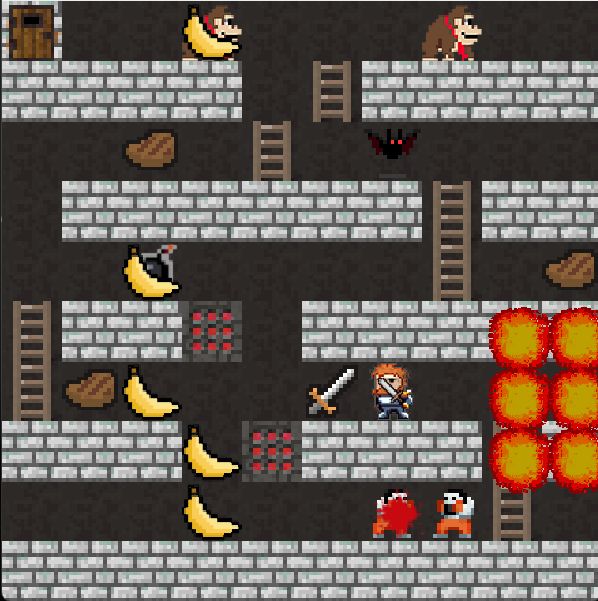
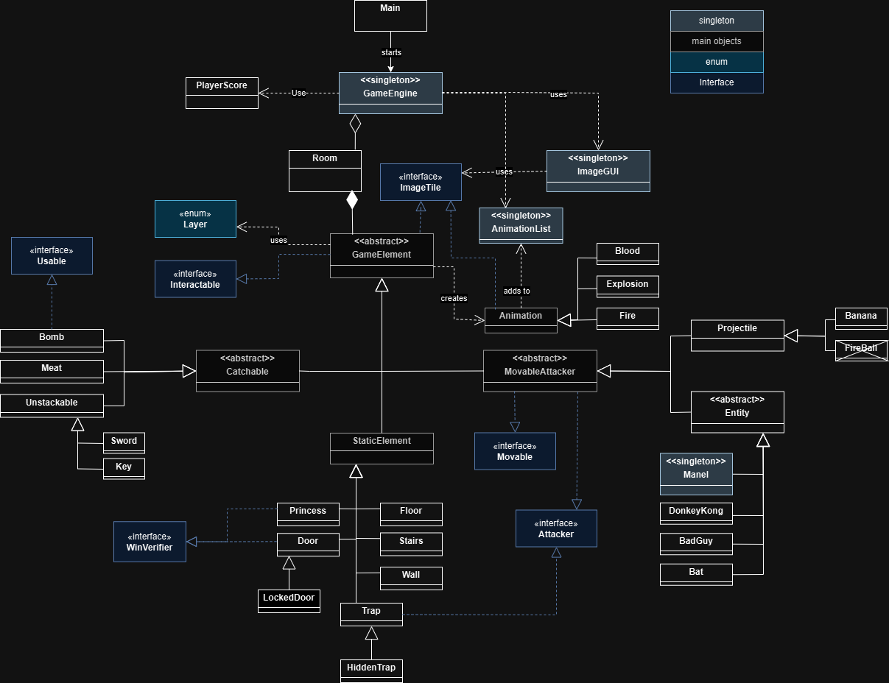

# Donkey Kong 2D - Java Game
<div align="center">
  
</div>

## Description

This is a 2D game inspired by the classic **Donkey Kong**, developed in **Java**. The project was originally created as part of the **Object-Oriented Programming (POO)** course. Currently, I am working on improving and expanding the project to enhance its features and gameplay.

The game follows the original mechanics where the main character (Manel) must climb platforms to rescue the princess while avoiding obstacles like traps, enemies and bananas thrown by Donkey Kong.

**Note:** The initial structure of the game was provided by my professors as part of the course. They set up a basic package structure with the following components:

- **objects** – A package with manel, floor and a wall.
- **pt.iscte.poo.game** – The basic game logic framework.
- **pt.iscte.poo.gui** – The starting point for the graphical user interface (GUI).
- **pt.iscte.poo.observer** – A package classes for implementing the observer pattern.
- **pt.iscte.poo.utils** – Some utility classes with initial code that supported future game functionality.

These files enabled the initialization of the game but did not contain any gameplay or interactive content. I then expanded on this initial setup by modifying some of the game initialization logic, implementing the core gameplay mechanics, adding levels, and creating a scoreboard to meet the project requirements, along with some extra features, such as animations and other components, to make the game more enjoyable.

Although efficiency was not a priority at the outset due to the project's smaller scale and the primary focus on its object-oriented programming (OOP) aspects, I now plan to shift my attention toward optimizing the game, enhancing its performance, and improving its overall quality.

## Game Commands

Here are the commands you can use during gameplay:

- **Arrow Keys**: Move your character (Manel) left, right, up, and down.
- **B**: Drop a bomb at the current position

## Features

- 2D game with simple graphics.
- Main character (Manel) can move left, right, up, and down, and can temporarily become immune to gravity while moving fast between platforms.
- Avoid enemies, traps and obstacles thrown by Donkey Kong.
- Multiple levels with increasing difficulty.
- Scoring system based on time.

## Technologies Used

- **Java** (for game logic and graphical interface interaction).
- **Java Swing** (for graphical interface and window handling).

## How to Run the Game

1. Clone the repository:

   ```bash
   git clone https://github.com/MD2SA/DonkeyKong.git

2. Run the Game

- Option 1: Using an IDE (e.g., Eclipse)
  - If you're using an IDE like Eclipse, simply open the project and run the `Main` class directly.
    
- Option 2: Using Command Line (Manual Compilation)
  - If you prefer running the game via the command line or have made changes to the code, you can compile and run it manually. To make this process easier for Windows users, a script `run.ps1` has been created.

    ```bash
    .\run.ps1

> **Note:** You can load custom rooms by providing the path to your rooms folder as an argument when running the game.

# 📋 Task List - DonkeyKong

## 🛠️ Logic and Interaction
- [ ] Improve game interaction logic
  - [x] All interactions are guaranteed to complete in O(n) time or better.
  - [ ] Reduce duplicate memory
    - [ ] Remove main List and leave only HashMap
- [x] Fix found bugs in game mechanics
  - [x] Bomb not exploding alone
  - [x] Trap with weird activation
- [ ] Refactor gravity logic for more realistic behavior

## 🚀 New Features
- [ ] Add new levels or maps
- [ ] Introduce new characters or enemies
- [ ] Implement power-ups or collectibles
- [ ] Improve scoring system
  - [ ]  Show the leaderboard in a specific room
  - [ ]  Add points to each run
- [ ] Implement a visual inventory
- [ ] Implement new alternative movement controls in addition to the arrow keys, such as WASD for gamers and HJKL for Vim users.
- [ ] New movement
  - [ ] Jump
  - [ ] Sprint  
- [ ] Include animations for entities' actions

## 🧪 Testing
- [ ] Write unit tests for core game logic
- [ ] Test edge cases for player interactions

## 🎨 Design and UI
- [ ] Improve visual feedback for player actions (e.g., sound effects, visual cues)
- [ ] Make the game window resizable
- [ ] Create better UI for entire window
- [ ] Add a pause menu with options (e.g., restart, exit)
- [ ] Ensure the game scales correctly when resized

## 📚 Documentation
- [x] Write a `README.md` with:
  - [x] Project description
  - [x] Instructions to set up and run the game
  - [x] Controls and gameplay guide
- [ ] Add in-code comments for key functions and modules
- [ ] Create a flowchart for game mechanics and interactions

## 🧹 Optimization and Maintenance
- [ ] Optimize game performance (e.g., reduce lag, improve FPS)
- [ ] Refactor code for better readability and modularity
- [ ] Fix any performance issues

## 🌟 Future Ideas
- [ ] Add multiplayer support (local or online)
- [ ] Implement a level editor for users to create their own maps
- [ ] Add achievements or unlockable content

# UML DIAGRAM

<div align="center">
  
</div>
